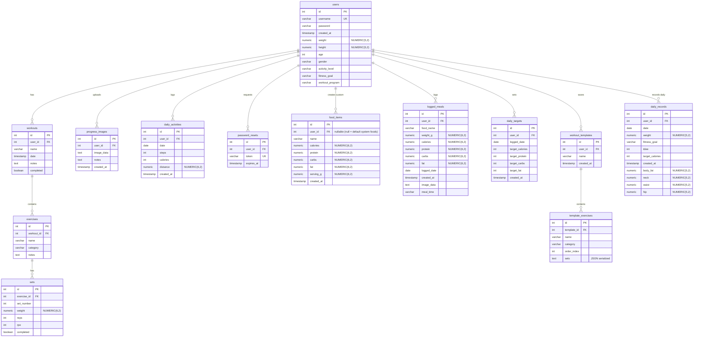

# Database ERD & Optimization Documentation

This document describes the Entity-Relationship Diagram (ERD) and the query optimization strategy for the Raga database.

## Entity Relationship Diagram (ERD)

The following Mermaid diagram visualizes the database tables and their relationships.

---

## Query Optimization Strategy

### 1. Database Indexing (Implemented)
To optimize standard SQL queries and joins across all features (especially in the main concurrent data loader `app/api/init-data/route.js`), indexes have been added to the database:

| Table | Index Name | Index Columns | Purpose |
|---|---|---|---|
| **workouts** | `idx_workouts_user_id` | `(user_id)` | Speeds up filtering workouts by user. |
| | `idx_workouts_date` | `(date)` | Speeds up sorting/filtering workouts by date. |
| | `idx_workouts_user_date` | `(user_id, date DESC)` | Optimizes dashboard query loading workouts chronologically. |
| **exercises** | `idx_exercises_workout_id` | `(workout_id)` | Optimizes nested queries joining exercises to workouts. |
| **sets** | `idx_sets_exercise_id` | `(exercise_id)` | Optimizes nested queries joining sets to exercises. |
| | `idx_sets_completed` | `(completed)` | Speeds up personal record (PR) aggregations (`completed = TRUE`). |
| **progress_images** | `idx_progress_images_user_id` | `(user_id)` | Speeds up progress picture fetches per user. |
| | `idx_progress_images_created_at`| `(created_at)` | Speeds up sorting progress images by date. |
| **daily_activities**| `idx_daily_activities_user_id` | `(user_id)` | Speeds up activity summaries per user. |
| | `idx_daily_activities_date` | `(date)` | Speeds up daily metrics calculations. |
| | `idx_daily_activities_user_date`| `(user_id, date)` | Optimizes fetching activity logs for a specific day. |
| **password_resets**| `idx_password_resets_user_id` | `(user_id)` | Speeds up password reset lookups. |
| **food_items** | `idx_food_items_user_id` | `(user_id)` | Speeds up loading custom food items + default system food items. |
| **logged_meals** | `idx_logged_meals_user_id` | `(user_id)` | Speeds up user calorie logs retrieval. |
| | `idx_logged_meals_logged_date`| `(logged_date)` | Speeds up dashboard nutrition summaries per date. |
| | `idx_logged_meals_user_date` | `(user_id, logged_date)` | Optimizes fetching food logs for specific user diaries. |
| **daily_targets**| `idx_daily_targets_user_id` | `(user_id)` | Speeds up calorie target fetches. |
| | `idx_daily_targets_logged_date`| `(logged_date)` | Speeds up calorie target queries. |
| **workout_templates**| `idx_workout_templates_user_id`| `(user_id)` | Speeds up fetching workout templates. |
| **template_exercises**| `idx_template_exercises_template_id`| `(template_id)`| Speeds up nested template exercise joins. |
| **daily_records** | `idx_daily_records_user_id` | `(user_id)` | Speeds up weight logs and body measurement lookups. |
| | `idx_daily_records_date` | `(date)` | Speeds up daily record history sorting. |

### 2. Concurrent Processing (`Promise.all`)
In `app/api/init-data/route.js`, the application fetches all initial dashboard data concurrently using `Promise.all` instead of sequencing them synchronously. With indexes on the database foreign keys, these concurrent queries run with maximum performance, returning the entire dataset to the dashboard in a fraction of a second.

### 3. Cascading Deletes (`ON DELETE CASCADE`)
All foreign keys have been configured with `ON DELETE CASCADE`. When a user deletes their account, or deletes a workout, all related sub-items (exercises, sets, meals, targets) are deleted automatically at the database engine level, preserving relational integrity and preventing database bloating.
